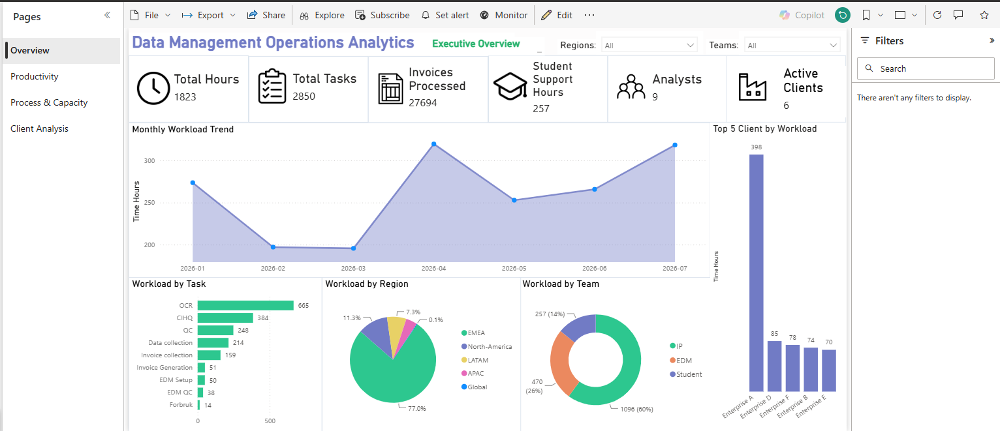
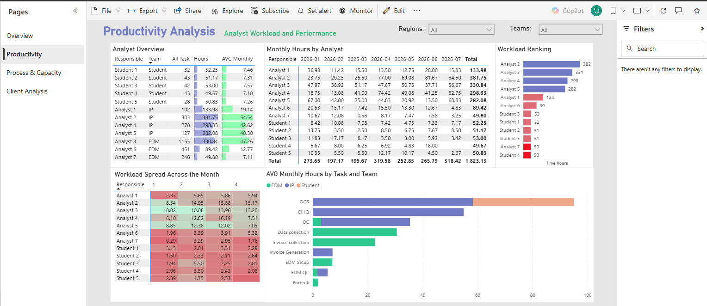
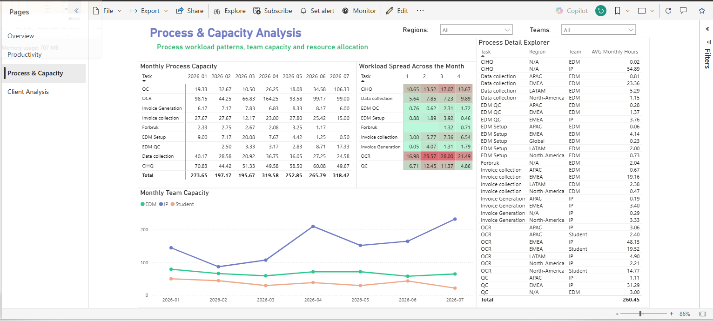
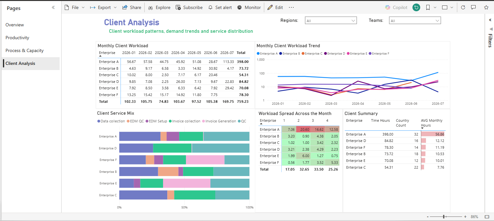
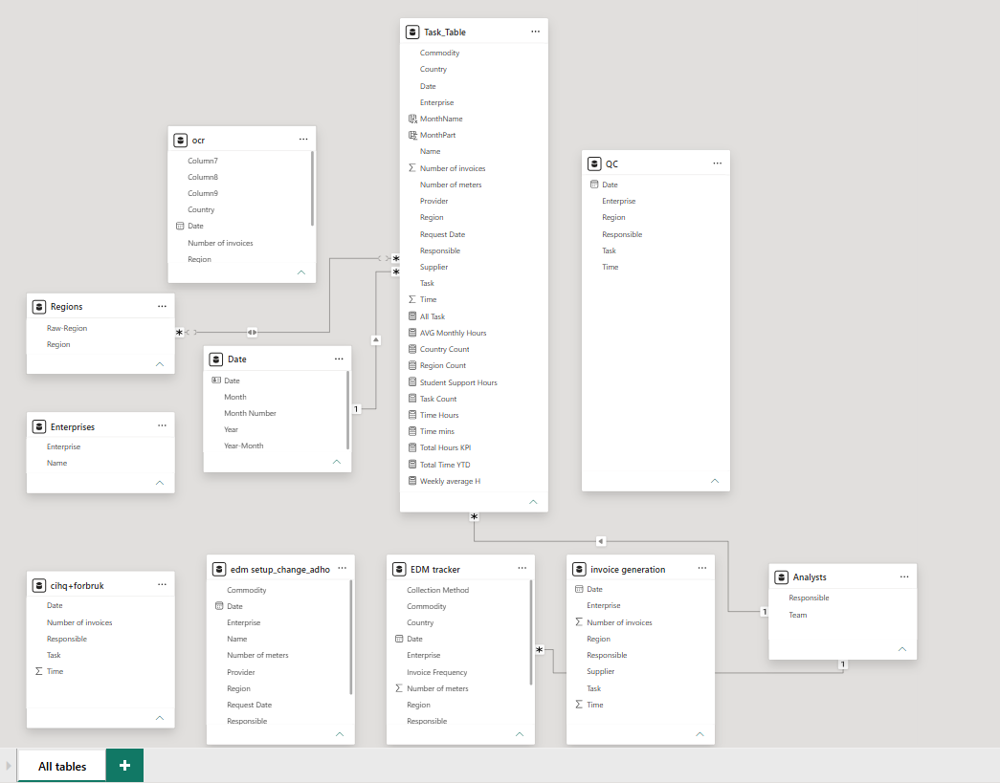

Data Management Operations Analytics

Overview

Data Management Operations Analytics is a business intelligence solution designed to provide end-to-end visibility into operational workload, resource allocation, process performance and client demand.

The project consolidates operational data from multiple business processes into a centralized Power BI reporting environment, enabling both management-level monitoring and operational decision-making.

Business Objective

The solution was designed to answer the following operational questions:
- How does workload evolve over time?
- Which analysts and teams carry the highest workload?
- Which operational processes consume the most capacity?
- How is workload distributed across clients?
- Which clients generate the highest operational demand?
- How does workload vary throughout the month?
- How are resources utilized across operational processes?

Solution Architecture
  Monday.com / Operational Trackers / Source Files
    -> Power Query ETL
      -> Unified Data Model
        -> Power BI
          ->Operations Performance Analysis

Data Preparation      
  Power Query was used to:
  - Standardize operational datasets
  - Clean and transform data
  - Consolidate multiple process files
  - Create a unified category-based data model

Key Capabilities
- Workload Analysis
- Capacity Tracking
- Operational KPI Reporting
- Performance Analytics
- Trend Monitoring

Technologies
- Monday.com
- Power Query
- Power BI
- DAX

Data Model

Skills Demonstrated:
- Power BI Dashboard Development
- Power Query ETL
- Data Modeling
- DAX Calculations
- Capacity Analysis
- Operational Analytics
- Client Demand Analysis
- Business Intelligence Reporting

